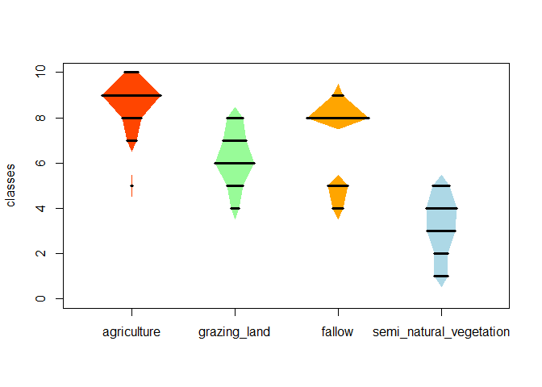

<!-- README.md is generated from README.Rmd. Please edit that file -->


# Lexiguel
A mingle-mangle of functions for R, most of them related to publications done by
maintainer.
Thus would you like to implement some plots or analyses done in one of my
publications?
Then, `Lexiguel` is the proper place to exchange requests and answers.

Thanks to **Kerstin**, my girlfriend, for the crazy name of the package.


## Updating to the last version of Lexiguel
You may have previously installed the R-package
[devtools](https://github.com/hadley/devtools).
Then execute following commands in your R-session:


```r
library(devtools)
install_github("kamapu/Lexiguel")
```

## Some examples

### Calculation of SLOSS-curves and SLOSS-index
The function `sloss` calculates the cumulative species number and area from the
smallest to the largest unit and _vice versa_ (Quinn & Harrison 1988).
A plot method is available for the respective output objects.


```r
## Load gaps from the Robinson Crusoe Island
library(Lexiguel)
data(rc_gaps)
data(rc_gaps.env)

## Calculation of curves
rc_curves <- sloss(rc_gaps, rc_gaps.env, area)
#> Error in eval(expr, envir, enclos): could not find function "sloss"

## Plot the curves
plot(rc_curves, show.legend=TRUE)
#> Error in plot(rc_curves, show.legend = TRUE): object 'rc_curves' not found
```

### Shadowplot and stringplot
The functions `shadowplot` and `stringplot` are alternatives to `boxplot` and
`violin.plot` for categorical (ordinal) variables.
Such plots shows the relative frequency of single classes among sampling units,
as in the case of WET-health scores (Beuel et al. 2016).


```r
## Example in shadowplot help
library(Lexiguel)
data(WHscores)

shadowplot(WET_veg ~ Landuse, WHscores, start=0, end=10,
        col=c("orangered","palegreen","orange","lightblue"))
stringplot(WET_veg ~ Landuse, WHscores, lwd=3, at=1)
```




