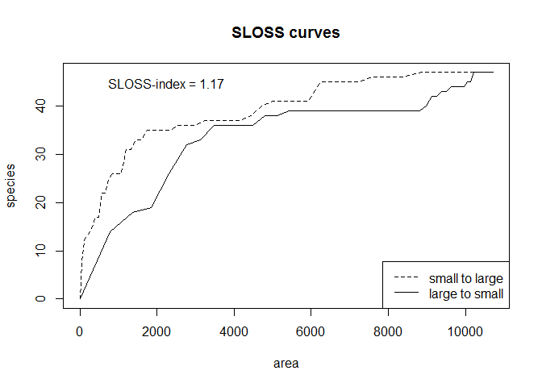

<!-- README.md is generated from README.Rmd. Please edit that file -->


# Lexiguel
A mingle-mangle of functions for R, most of them related to publications done by
maintainer.
Thus would you like to implement some plots or analyses done in one of my
publications?
Then, `Lexiguel` is the proper place to exchange requests and answers.

Thanks to **Kerstin**, my girlfriend, for the crazy name of the package.


## Updating to the last version of Lexiguel
You may have previously installed the R-package
[devtools](https://github.com/hadley/devtools).
Then execute following commands in your R-session:


```r
library(devtools)
install_github("kamapu/Lexiguel")
```

## Some examples


```r
## Load gaps from the Robinson Crusoe Island
library(Lexiguel)
data(rc_gaps)
data(rc_gaps.env)

## Calculation of curves
rc_curves <- sloss(rc_gaps, rc_gaps.env, area)

## Plot the curves
plot(rc_curves, show.legend=TRUE)
```


